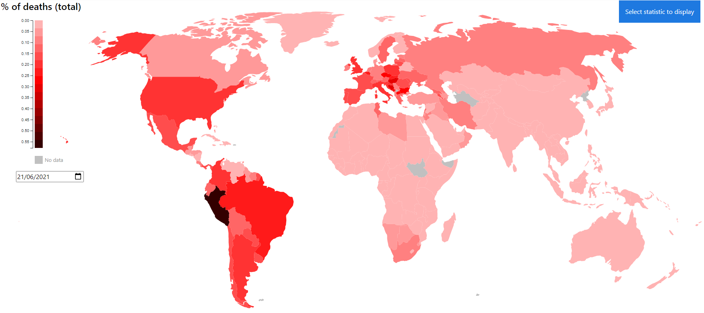

# Overview
## Map


## Timeseries


## Race


## Table


# Objectif
Create a web application that allows multiple views of Covid19 pandemic data.

**Data**: https://raw.githubusercontent.com/owid/covid-19-data/master/public/data/owid-covid-data.csv?raw=true
# Requirements
- Python 3.8
- Pandas
- Flask

# Setup
Pour lancer:
```
    $ python run.py
```
Accès: http://127.0.0.1:8000/